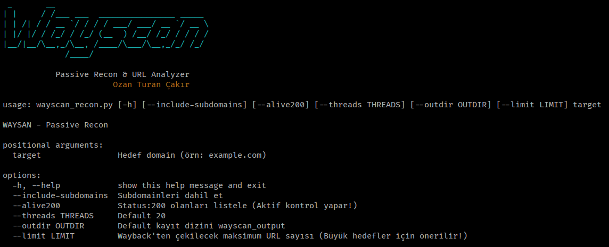

 
Wayscan, hedeflediğiniz bir domainin (alan adı) geçmiş URL'lerini Wayback Machine'den (Internet Archive CDX API) pasif olarak toplayan ve bu URL'leri potansiyel güvenlik zafiyetlerine göre analiz eden bir Python aracıdır.

**Yazar:** Ozan Turan Çakır

⚠️ Bu aracı yalnızca izinli testlerde kullan.


## Kullanım
wayscan_recon.py [-h] [--include-subdomains] [--alive200] [--threads THREADS] [--outdir OUTDIR] [--limit LIMIT] target


## Gereksinimler
- Python 3.8+
- requests, termcolor, pyfiglet


## ⚙️ Kurulum

Wayscan, Python 3.x gerektirir. Gerekli kütüphaneleri yüklemek için:

```bash
git clone [https://github.com/ozanturancakir/Wayscan.git](https://github.com/ozanturancakir/Wayscan.git)
cd Wayscan
pip3 install -r requirements.txt


